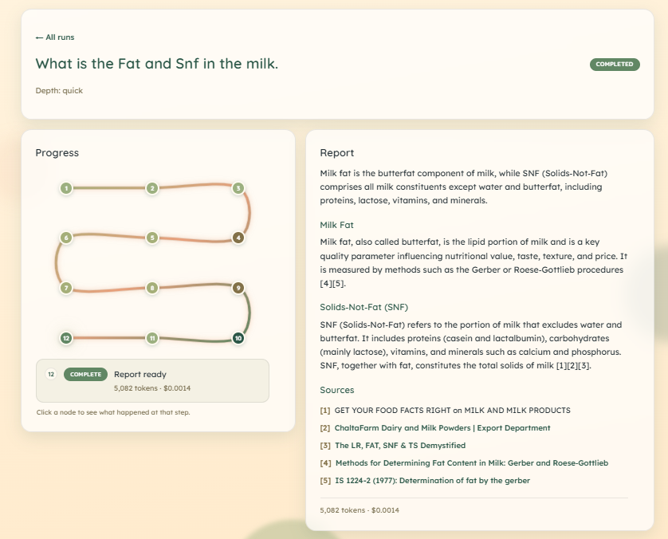
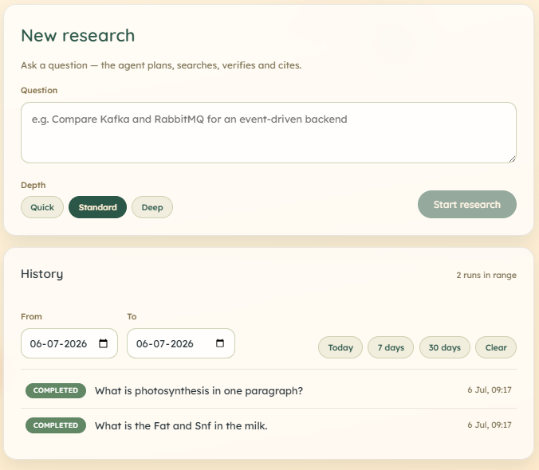
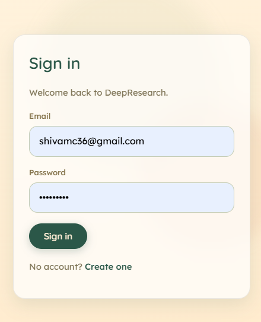

# DeepResearch — Agentic AI Research Assistant (RAG + Tool Use)

Ask a question and DeepResearch's agent **plans** the sub-questions, **searches** the web
and your own uploaded documents, **verifies** each claim against its sources, and hands
back a properly **cited report** — streaming every step to you live so you can watch it think.

I built this end to end to see what it takes to move an AI agent from a notebook demo to a
real, production-shaped system: an event-driven backend with async workers, live streaming,
retrieval-augmented generation, observability, an automated evaluation gate, and a full
CI/CD + Kubernetes setup — not just an LLM call behind a form.

[](https://github.com/Shivamchaubey14/research-agent/actions/workflows/ci.yml)

---

## A look at it

Every research run streams its progress as an animated roadmap on the left while the cited
report builds on the right — the two sit side by side on desktop and stack on mobile.



<table>
  <tr>
    <td width="50%"></td>
    <td width="50%"></td>
  </tr>
  <tr>
    <td align="center"><em>Ask a question, choose a depth, and browse past runs</em></td>
    <td align="center"><em>Email + password auth (JWT with silent refresh)</em></td>
  </tr>
</table>

---

## What it does

- **Autonomous research loop** — the agent plans sub-questions, searches, reads results,
  verifies claims, and only then writes the report. Every factual statement carries a
  numbered citation back to its source.
- **Live progress** — each step (plan → search → observe → verify → report) streams to the
  browser over Server-Sent Events, so a run is transparent instead of a spinner.
- **Bring your own documents (RAG)** — upload PDFs/text and the agent will search and cite
  *your* files alongside the web, scoped so you only ever retrieve your own content.
- **Depth control** — `quick`, `standard`, or `deep` trades off iterations, searches, and
  token/latency budget.
- **Run history & cost** — every run is saved with its report, token usage, and dollar cost.

---

## How it works

```
React (Vite)  ──HTTP / SSE──►  Django + DRF ──produce──►  Kafka  ──consume──►  Agent Worker(s)
     ▲                              │   ▲                   topics                   │
     │                           MySQL    │             (jobs, events)      LLM API + Web Search
     └──── live progress ◄── Redis ◄──────┴───────── progress events ◄───────────────┘
                                                                       Qdrant (RAG vector store)
```

The system is **event-driven on purpose**: a research run can take a while and lean on a slow
LLM, so the API never does that work inline.

1. The **Django + DRF API** authenticates the user, saves the run, and drops a job onto a
   **Kafka** topic — then returns immediately.
2. A **Python worker** consumes the job and runs the agent's tool-use loop
   (*plan → search → verify → cite*), driving the run through
   `QUEUED → RUNNING → COMPLETED / FAILED / CANCELLED` and persisting the report, citations,
   tokens, and cost. A terminally failed job is routed to a dead-letter topic for inspection.
3. Every step the agent takes is written to a per-run **Redis stream**, which the API replays
   to the browser as **Server-Sent Events** — ordered, resumable on reconnect (`Last-Event-ID`),
   and retained so a late subscriber still sees the whole run.
4. Uploaded documents are chunked, embedded locally, and stored in **Qdrant**; at run time the
   agent gets a `document_search` tool that retrieves the most relevant chunks (filtered to the
   owner) and folds them into its evidence.

The worker reuses the backend's ORM and messaging/streaming helpers, so the data schema and
event format have a single source of truth across both services.

---

## Tech stack

| Layer            | Tech                                   | Responsibility                                       |
|------------------|----------------------------------------|------------------------------------------------------|
| Frontend         | React + Vite                           | Auth UI, live agent-step streaming, report viewer    |
| API              | Django + Django REST Framework, JWT    | Auth, users, reports, run history, job dispatch      |
| Messaging        | Apache Kafka                           | Async job queue + dead-letter topic                  |
| Worker           | Python (Kafka consumer)                | The agent loop: plan → search → verify → cite        |
| LLM              | Groq (OpenAI-compatible API)           | Reasoning, tool use, synthesis                       |
| Web search       | Tavily                                 | Client-side `web_search` tool                        |
| RAG store        | Qdrant + fastembed (`bge-small-en`)    | Vector search over uploaded documents                |
| Streaming / cache| Redis Streams                          | Live SSE progress fan-out                            |
| Database         | MySQL 8                                | Source of truth                                      |
| Packaging        | Docker / docker-compose                | Every service containerized                          |
| Orchestration    | Kubernetes                             | Independent worker autoscaling (HPA)                 |
| CI/CD            | GitHub Actions                         | Lint → test → build images → eval gate               |

---

## Getting started

The fastest path is Docker — it boots MySQL, Qdrant, Kafka, Redis, the API, the worker, and
the frontend together:

```bash
cp .env.example .env          # add your GROQ_API_KEY (TAVILY_API_KEY optional, enables web search)
docker compose up --build
```

| Service   | URL                              |
|-----------|----------------------------------|
| Frontend  | http://localhost:5173            |
| API       | http://localhost:8000/api        |
| Qdrant UI | http://localhost:6333/dashboard  |

<details>
<summary><strong>Running a service on its own (without Docker)</strong></summary>

**Backend** (needs a local MySQL; defaults assume user `root`, database `research`):

```bash
cd backend
python -m venv .venv && source .venv/Scripts/activate   # Windows
pip install -r requirements.txt
python manage.py migrate
python manage.py runserver
```

**Frontend:**

```bash
cd frontend
npm install
npm run dev          # http://localhost:5173  (override the API base with VITE_API_URL)
```

**Agent worker** — you can run one research job straight from the CLI, no Kafka/Redis needed
(progress prints to stderr, the final cited report to stdout):

```bash
cd worker
python -m venv .venv && source .venv/Scripts/activate   # Windows
pip install -r requirements.txt
export GROQ_API_KEY=gsk_...                              # or put it in .env
export TAVILY_API_KEY=tvly-...                           # optional: web search
python -m worker.cli "Compare Kafka and RabbitMQ for an event queue" --depth deep
```

</details>

---

## API

Endpoints are versioned under `/api/v1`:

| Method & Path                | Auth  | Purpose                                             |
|------------------------------|-------|-----------------------------------------------------|
| `POST /auth/register`        | —     | Create an account                                   |
| `POST /auth/token`           | —     | Obtain JWT access + refresh tokens                  |
| `POST /auth/token/refresh`   | JWT   | Rotate the access token                             |
| `GET  /auth/me`              | JWT   | Current user profile                                |
| `POST /runs`                 | JWT   | Submit a question → a `QUEUED` run                  |
| `GET  /runs`                 | JWT   | List the caller's runs (newest first)               |
| `GET  /runs/{id}`            | JWT   | Fetch a run and its report                          |
| `GET  /runs/{id}/events`     | JWT   | Live progress over SSE (`?token=` for EventSource)  |
| `POST /runs/{id}/cancel`     | JWT   | Cancel a `QUEUED`/`RUNNING` run                     |
| `POST /documents`            | JWT   | Upload a document for RAG ingestion                 |
| `GET  /documents`            | JWT   | List the caller's documents                         |
| `GET  /health` · `/ready`    | —     | Liveness / per-dependency readiness                 |
| `GET  /admin/metrics` · `/admin/runs` | staff | Run counts, queue depth, cost, worker heartbeat |

---

## Quality: tests, observability & evals

- **Tests** — unit suites across the backend, worker, and frontend run on every push and PR.
- **Structured logging** — both tiers emit one JSON event per line, correlated by `run_id`, so
  a single run can be traced across the API and the worker.
- **Health & readiness** — `/health` (process + DB) and `/ready` (per-dependency: DB, Redis,
  Kafka, Qdrant). `/ready` only fails hard if the database is down; a transient Qdrant/Kafka
  blip reports `degraded` rather than pulling the API out of rotation.
- **Agent evaluation** — because the agent is probabilistic, quality is measured with a
  versioned eval suite (LLM-as-judge on faithfulness, citation validity, answer relevance, and
  hallucination rate, plus cost and latency). It runs the *real* pipeline and exits non-zero
  when it drops below threshold, so CI can block a regressing release.

```bash
# backend / worker / frontend test suites
python backend/manage.py test
python -m unittest discover -s worker/tests -t .
cd frontend && npm test

# the agent eval gate (needs GROQ_API_KEY)
python -m worker.evals            # prints a scorecard; exit code gates CI
```

---

## Deployment

Every service has a Dockerfile, and `docker compose up --build` runs the whole stack locally.
For a cluster, `infra/k8s/` holds Kubernetes manifests (`kubectl apply -k infra/k8s`): the
backing infra as StatefulSets with PVCs, the API behind a Service with `/health` + `/ready`
probes and a migrate init-container, the **worker as its own Deployment with a CPU
HorizontalPodAutoscaler** so it scales independently of the API, and an nginx Ingress that
routes `/api` → backend and `/` → frontend with SSE buffering disabled.

CI/CD runs in GitHub Actions: `ci.yml` lints (ruff), runs the test suites against a MySQL
service container, builds the frontend, and builds all three Docker images — so a broken
Dockerfile or failing test blocks the merge. A separate `evals.yml` runs the agent eval gate
on a schedule.

---

## Project structure

```
research-agent/
├── backend/          # Django + DRF API (auth, reports, job dispatch, admin metrics)
├── worker/           # Kafka consumer running the agent loop + RAG ingestion + evals
├── frontend/         # React (Vite) single-page app
├── infra/k8s/        # Kubernetes manifests
├── .github/workflows # CI + eval pipelines
├── docker-compose.yml
└── .env.example
```

---

## Roadmap

Built and working: JWT auth and the relational data model · the agent worker
(plan → search → verify → cite) · async job dispatch with live SSE streaming · the React UI ·
full RAG (document ingestion + agent retrieval) · structured logging and operational
endpoints · a gated agent-eval suite · and the containerization / CI/CD / Kubernetes layer.

Next up: a live public deployment and polish — pushing images from CI, a production frontend
build behind nginx, managed secrets, and TLS.
